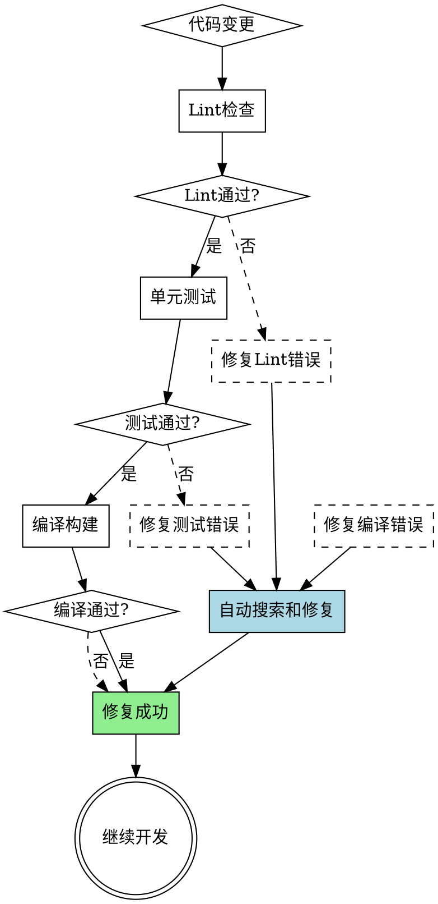

# OpenHarmony 应用错误检测

## 概述

OpenHarmony应用开发需要系统化的错误检测机制。通过三层检测（lint → 单元测试 → 编译）及时发现错误，并通过自动化的网络搜索和文档查找快速定位和修复问题。

**核心原则：** 快速失败、自动修复、持续验证

## 错误检测流程



## 快速参考

| 检测阶段 | 工具/命令 | 目的 | 典型错误类型 |
|---------|-----------|------|------------|
| **Lint** | `hvigorw lint` 或 `npm run lint` | 代码规范检查 | 格式问题、未使用变量、类型问题 |
| **单元测试** | `hvigorw test` 或 `npm test` | 功能正确性验证 | 逻辑错误、边界条件、集成问题 |
| **编译构建** | `hvigorw assembleHap` | 可执行性验证 | 语法错误、依赖缺失、API不兼容 |

## 第一阶段：Lint检查

### 运行Lint

```bash
# 使用hvigorw运行lint
hvigorw --no-daemon app:lintDebug

# 或使用npm脚本
npm run lint
```

### 常见Lint错误及修复

| 错误类型 | 示例 | 修复方法 |
|---------|------|---------|
| **未使用变量** | `let x: number = 10;` | 删除变量或使用 `// eslint-disable-next-line` |
| **类型不匹配** | `let x: string = 10;` | 修正类型声明或转换类型 |
| **缺少类型注解** | `let x = 10;` | 添加类型注解 `let x: number = 10;` |
| **ArkTS严格模式** | 使用JS特性 | 替换为ArkTS兼容写法 |
| **代码格式** | 缩进不统一 | 运行 `npm run lint -- --fix` 自动修复 |

### 自动化Lint修复

```bash
# 自动修复可修复的lint错误
npm run lint -- --fix
```

## 第二阶段：单元测试

### 编写测试用例

```typescript
// example.test.ets
import { describe, it, expect } from '@ohos/hypium';

export default function exampleTest() {
  describe('MathUtils', () => {
    it('should add two numbers correctly', () => {
      const result = add(2, 3);
      expect(result).assertEqual(5);
    });

    it('should handle zero', () => {
      const result = add(0, 0);
      expect(result).assertEqual(0);
    });
  });
}
```

### 运行测试

```bash
# 运行所有测试
hvigorw --no-daemon test

# 运行特定测试
hvigorw --no-daemon test --tests example.test.ets

# 生成覆盖率报告
hvigorw --no-daemon test --coverage
```

### 测试最佳实践

- **测试命名：** `should + 动作 + 期望结果`
- **边界测试：** 测试0、空值、最大最小值
- **异步测试：** 使用 `async/await` 和 `done` 回调
- **Mock依赖：** 隔离外部依赖和UI组件

## 第三阶段：编译构建

### 编译命令

```bash
# Debug模式编译
hvigorw assembleHap

# Release模式编译
hvigorw assembleHap --mode release

# 清理构建缓存
hvigorw clean
```

### 常见编译错误及修复

| 错误类型 | 示例 | 修复方法 |
|---------|------|---------|
| **API不兼容** | 使用未引入的API | 检查API版本限制，更新配置 |
| **依赖缺失** | `Module not found` | 安装缺失的依赖 `ohpm install` |
| **类型错误** | 类型推断失败 | 添加显式类型注解 |
| **资源文件错误** | 图片/资源不存在 | 检查资源路径和名称 |
| **签名问题** | 证书过期或配置错误 | 更新签名配置 |

## 第四阶段：错误自动搜索和修复

### 自动化修复流程

当检测到错误后，自动执行以下搜索策略：

```typescript
// 错误处理流程伪代码
async function handleError(error: Error) {
  // 1. 提取错误关键词
  const keywords = extractErrorKeywords(error.message);

  // 2. 搜索本地文档
  const localDocs = searchLocalDocs(keywords);

  // 3. 搜索OpenHarmony官方文档
  const officialDocs = searchOfficialDocs(keywords);

  // 4. 搜索网络资源
  const webResults = searchWeb(keywords);

  // 5. 综合分析并生成修复建议
  const fixSuggestion = analyzeAndSuggest(error, localDocs, officialDocs, webResults);

  // 6. 应用修复
  await applyFix(fixSuggestion);
}
```

### 搜索策略

#### 1. 本地文档搜索

```bash
# 搜索本地OpenHarmony文档
find docs-OpenHarmony* -type f -name "*.md" | xargs grep -l "错误关键词"
```

#### 2. 官方文档搜索

**在线文档：**
- OpenHarmony应用开发: https://docs.openharmony.cn/application-dev/
- API参考: https://docs.openharmony.cn/application-dev/reference/
- 常见问题: https://docs.openharmony.cn/faq/

**搜索关键词模式：**
- 错误消息中的关键短语
- API名称 + "not found" / "undefined"
- 编译器错误代码
- "ArkTS" + 特性名称

#### 3. 网络资源搜索

**搜索渠道：**
- OpenHarmony Gitee社区: https://gitee.com/openharmony
- OpenHarmony官方论坛: https://developer.openharmony.cn/
- Stack Overflow: 搜索 "OpenHarmony" + 关键词

### 常见错误搜索模式

| 错误类型 | 搜索关键词 | 预期结果来源 |
|---------|-----------|-------------|
| **API版本错误** | `API 12+ XXX not found` | API参考文档 |
| **类型错误** | `Type 'XXX' is not assignable to type 'YYY'` | ArkTS语法指南 |
| **构建错误** | `hvigorw build failed XXX` | 构建工具文档 |
| **权限错误** | `Permission denied XXX` | 权限管理文档 |
| **UI渲染错误** | `Component render error XXX` | UI组件文档 |

## 自动修复实现

### 修复脚本示例

```typescript
import { readFile, writeFile } from '@kit.ArkTS';

async function autoFixError(filePath: string, errorPattern: string, fixPattern: string) {
  const content = await readFile(filePath);

  if (content.includes(errorPattern)) {
    const fixedContent = content.replace(new RegExp(errorPattern, 'g'), fixPattern);
    await writeFile(filePath, fixedContent);
    console.info(`Fixed error in ${filePath}`);
  }
}

// 使用示例
await autoFixError(
  'entry/src/main/ets/pages/Index.ets',
  'let x = 10;',
  'let x: number = 10;'
);
```

### 批量修复工具

```bash
# 批量修复TypeScript类型错误
find . -name "*.ets" -exec sed -i '' 's/let \([a-zA-Z_][a-zA-Z0-9_]*\) = \([0-9]\+\);/let \1: number = \2;/g' {} \;

# 批量添加显式类型注解
find . -name "*.ets" -exec sed -i '' 's/const \([a-zA-Z_][a-zA-Z0-9_]*\) = \[/\const \1: Array<unknown> = [/g' {} \;
```

## 完整的错误检测脚本

```typescript
import { exec } from '@kit.ArkTS';

class OpenHarmonyErrorDetector {
  async detectAndFix() {
    console.info('开始错误检测流程...');

    // 阶段1: Lint检查
    const lintResult = await this.runLint();
    if (!lintResult.success) {
      await this.autoSearchAndFix(lintResult.errors);
      return; // 修复后重新开始
    }

    // 阶段2: 单元测试
    const testResult = await this.runTests();
    if (!testResult.success) {
      await this.autoSearchAndFix(testResult.errors);
      return;
    }

    // 阶段3: 编译构建
    const buildResult = await this.build();
    if (!buildResult.success) {
      await this.autoSearchAndFix(buildResult.errors);
      return;
    }

    console.info('所有检查通过！');
  }

  private async runLint(): Promise<{ success: boolean; errors: string[] }> {
    try {
      const result = await exec('hvigorw --no-daemon app:lintDebug');
      return { success: true, errors: [] };
    } catch (error) {
      return { success: false, errors: this.parseErrors(error) };
    }
  }

  private async runTests(): Promise<{ success: boolean; errors: string[] }> {
    try {
      const result = await exec('hvigorw --no-daemon test');
      return { success: true, errors: [] };
    } catch (error) {
      return { success: false, errors: this.parseErrors(error) };
    }
  }

  private async build(): Promise<{ success: boolean; errors: string[] }> {
    try {
      const result = await exec('hvigorw assembleHap');
      return { success: true, errors: [] };
    } catch (error) {
      return { success: false, errors: this.parseErrors(error) };
    }
  }

  private async autoSearchAndFix(errors: string[]) {
    console.info('发现错误，开始自动搜索和修复...');

    for (const error of errors) {
      const keywords = this.extractKeywords(error);
      const fix = await this.searchFix(keywords);

      if (fix) {
        await this.applyFix(fix);
      }
    }
  }

  private extractKeywords(error: string): string[] {
    // 提取错误关键词
    return error.split(/\s+/).filter(word => word.length > 3);
  }

  private async searchFix(keywords: string[]): Promise<string | null> {
    // 实现搜索逻辑（本地文档 + 官方文档 + 网络）
    return null;
  }

  private async applyFix(fix: string) {
    // 应用修复
    console.info(`应用修复: ${fix}`);
  }

  private parseErrors(error: unknown): string[] {
    // 解析错误消息
    return [error as string];
  }
}

// 使用
const detector = new OpenHarmonyErrorDetector();
await detector.detectAndFix();
```

## 常见问题

| 问题 | 原因 | 解决方案 |
|------|------|----------|
| Lint修复后测试失败 | 修复引入了新的逻辑错误 | 重新审查修改，确保逻辑正确 |
| 测试通过但编译失败 | 测试未覆盖所有代码路径 | 增加测试覆盖率，检查类型安全 |
| 编译成功但应用崩溃 | 运行时错误未在编译时检测 | 添加运行时检查和日志 |
| 自动搜索无结果 | 错误关键词提取不准确 | 手动调整搜索关键词 |
| 修复方案不适用 | 版本或API差异 | 检查OpenHarmony版本和API兼容性 |

## 最佳实践

1. **频繁运行检查：** 每次代码变更后立即运行lint和测试
2. **小步提交：** 每次提交前确保所有检查通过
3. **持续集成：** 在CI/CD中集成自动化检查流程
4. **文档优先：** 遇到问题时先查阅官方文档
5. **版本一致：** 确保文档和API版本与项目版本一致
6. **错误日志：** 保留完整的错误日志用于后续分析

## 参考资源

**官方文档：**
- OpenHarmony开发指南: https://docs.openharmony.cn/application-dev/
- 构建工具: https://docs.openharmony.cn/application-dev/ide/
- 测试框架: https://docs.openharmony.cn/application-dev/test/

**社区资源：**
- OpenHarmony Gitee: https://gitee.com/openharmony
- 开发者社区: https://developer.openharmony.cn/
- 问题追踪: https://gitee.com/openharmony/community/issues
