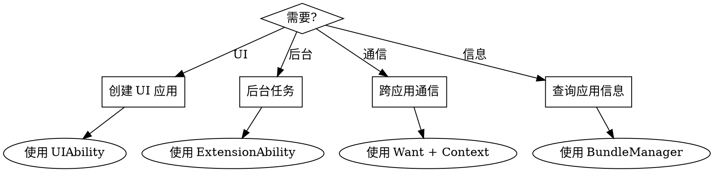

# OpenHarmony Ability Kit 快速参考

## 概述

Ability Kit 是 OpenHarmony Stage 模型中管理应用组件的核心框架。它提供:

- **UIAbility**: 带生命周期的 UI 应用组件
- **AbilityStage**: 模块级组件管理器,用于初始化
- **Want**: 组件间通信的数据载体
- **Context**: 应用/组件上下文,用于资源访问和操作
- **ExtensionAbility**: 扩展能力(Form、Service 等)
- **BundleManager**: 包和应用信息查询

**官方文档:** `docs-OpenHarmony-v6.0-Release/zh-cn/application-dev/reference/apis-ability-kit/`

## 决策流程



## 快速参考表

| 模块 | API 版本 | 用途 | 导入语句 |
|--------|-------------|---------|--------|
| UIAbility | 9+ | UI 应用组件 | `import { UIAbility } from '@kit.AbilityKit'` |
| AbilityStage | 9+ | 模块级管理器 | `import { AbilityStage } from '@kit.AbilityKit'` |
| Want | 9+ | 组件通信 | `import { Want } from '@kit.AbilityKit'` |
| common (Context) | 9+ | Context API | `import { common } from '@kit.AbilityKit'` |
| bundleManager | 9+ | 包查询 | `import { bundleManager } from '@kit.AbilityKit'` |
| wantAgent | 9+ | Want 封装 | `import { wantAgent } from '@kit.AbilityKit'` |
| appManager | 9+ | 应用生命周期管理 | `import { appManager } from '@kit.AbilityKit'` |
| AbilityConstant | 9+ | Ability 常量 | `import { AbilityConstant } from '@kit.AbilityKit'` |
| Configuration | 9+ | 系统配置 | `import { Configuration } from '@kit.AbilityKit'` |

## UIAbility 生命周期

### 生命周期状态

```
Create -> WindowStageCreate -> Foreground <-> Background -> WindowStageDestroy -> Destroy
```

### 关键回调

| 回调 | 调用时机 | 使用场景 |
|----------|-------------|----------|
| `onCreate(want, launchParam)` | Ability 创建时 | 初始化非 UI 资源 |
| `onWindowStageCreate(windowStage)` | 窗口就绪时 | 加载 UI 内容,设置窗口属性 |
| `onForeground()` | 进入前台时 | 恢复操作,刷新数据 |
| `onBackground()` | 进入后台时 | 保存状态,释放资源 |
| `onWindowStageDestroy()` | 窗口销毁时 | 清理窗口资源 |
| `onDestroy()` | Ability 销毁时 | 最终清理 |
| `onNewWant(want, launchParam)` | 重新激活(单例模式) | 处理新的意图 |

### 基础 UIAbility 模板

```typescript
import { UIAbility, AbilityConstant, Want } from '@kit.AbilityKit';
import { window } from '@kit.ArkUI';
import { hilog } from '@kit.PerformanceAnalysisKit';

export default class EntryAbility extends UIAbility {
  onCreate(want: Want, launchParam: AbilityConstant.LaunchParam): void {
    hilog.info(0x0000, 'testTag', 'Ability onCreate');
    // 初始化非 UI 资源
  }

  onWindowStageCreate(windowStage: window.WindowStage): void {
    hilog.info(0x0000, 'testTag', 'Ability onWindowStageCreate');

    // 加载主页面
    windowStage.loadContent('pages/Index', (err, data) => {
      if (err.code) {
        hilog.error(0x0000, 'testTag', 'Failed to load content: %{public}s', JSON.stringify(err));
        return;
      }
      hilog.info(0x0000, 'testTag', 'Succeeded in loading content');
    });
  }

  onForeground(): void {
    hilog.info(0x0000, 'testTag', 'Ability onForeground');
  }

  onBackground(): void {
    hilog.info(0x0000, 'testTag', 'Ability onBackground');
  }

  onDestroy(): void {
    hilog.info(0x0000, 'testTag', 'Ability onDestroy');
  }
}
```

### 启动类型

| 类型 | 值 | 说明 | 使用场景 |
|------|-------|-------------|----------|
| `SINGLETON` | 0 | 单实例 | 主入口、设置页 |
| `MULTITON` | 1 | 多实例 | 文档编辑器 |
| `SPECIFIED` | 2 | 开发者控制 | 自定义实例管理 |

在 `module.json5` 中配置:
```json
{
  "abilities": [{
    "name": "EntryAbility",
    "launchType": "singleton"
  }]
}
```

## AbilityStage

模块级组件管理器,在模块中的任何 Ability 之前创建。

### 关键回调

| 回调 | 调用时机 | 使用场景 |
|----------|-------------|----------|
| `onCreate()` | 模块首次加载时 | 资源预加载、线程创建 |
| `onDestroy()` | 最后一个 ability 退出时 (API 12+) | 模块清理 |
| `onAcceptWant(want)` | 指定启动模式 | 返回唯一 ability 键 |
| `onConfigurationUpdate(config)` | 系统配置变化时 | 处理语言/主题变化 |
| `onMemoryLevel(level)` | 内存压力时 | 释放非必要资源 |

### 基础 AbilityStage 模板

```typescript
import { AbilityStage, Want, Configuration, AbilityConstant } from '@kit.AbilityKit';

export default class MyAbilityStage extends AbilityStage {
  onCreate(): void {
    console.log('MyAbilityStage onCreate');
    // 模块初始化
  }

  onAcceptWant(want: Want): string {
    // 对于指定启动模式,返回唯一键
    if (want.abilityName === 'DocumentAbility') {
      return want.parameters?.docId as string || 'default';
    }
    return '';
  }

  onConfigurationUpdate(config: Configuration): void {
    console.log(`Config updated: ${JSON.stringify(config)}`);
  }

  onMemoryLevel(level: AbilityConstant.MemoryLevel): void {
    console.log(`Memory level: ${level}`);
    // 内存低时释放缓存
  }
}
```

## Want 对象

组件通信的数据载体。

### Want 结构

| 字段 | 类型 | 说明 |
|-------|------|-------------|
| `bundleName` | string | 目标包名 |
| `abilityName` | string | 目标 ability 名称 |
| `moduleName` | string | 目标模块名(可选) |
| `action` | string | 要执行的操作 |
| `entities` | string[] | 实体类别 |
| `uri` | string | 数据 URI |
| `type` | string | MIME 类型 |
| `parameters` | Record<string, Object> | 自定义参数 |
| `flags` | number | Want 标志 |

### 常用 Want 模式

**显式启动(同一应用)**
```typescript
let want: Want = {
  bundleName: 'com.example.myapp',
  abilityName: 'SecondAbility',
  parameters: {
    key1: 'value1',
    key2: 123
  }
};
this.context.startAbility(want);
```

**显式启动(跨应用) - API 11+ 限制**
```typescript
// API 11+ 要求第三方应用使用隐式启动
// 使用 openLink 代替:
this.context.openLink('https://example.com/path');
```

**隐式启动**
```typescript
let want: Want = {
  action: 'ohos.want.action.viewData',
  entities: ['entity.system.browsable'],
  uri: 'https://example.com'
};
this.context.startAbility(want);
```

**带结果启动**
```typescript
let want: Want = {
  bundleName: 'com.example.myapp',
  abilityName: 'SelectAbility'
};

this.context.startAbilityForResult(want).then((result) => {
  console.log(`Result code: ${result.resultCode}`);
  console.log(`Result data: ${JSON.stringify(result.want?.parameters)}`);
});
```

**返回结果**
```typescript
// 在目标 ability 中
let resultWant: Want = {
  parameters: {
    selectedItem: 'item1'
  }
};
this.context.terminateSelfWithResult({
  resultCode: 0,
  want: resultWant
});
```

### Want 标志

| 标志 | 值 | 说明 |
|------|-------|-------------|
| `FLAG_AUTH_READ_URI_PERMISSION` | 0x00000001 | 授予读取 URI 权限 |
| `FLAG_AUTH_WRITE_URI_PERMISSION` | 0x00000002 | 授予写入 URI 权限 |
| `FLAG_INSTALL_ON_DEMAND` | 0x00000800 | 按需安装 |

## Context 层级

### Context 类型

| Context | 作用域 | 关键 API |
|---------|-------|----------|
| `ApplicationContext` | 应用级 | `on/off('abilityLifecycle')`, `killAllProcesses()`, `setColorMode()` |
| `UIAbilityContext` | UIAbility | `startAbility()`, `terminateSelf()`, `requestPermissions()` |
| `AbilityStageContext` | AbilityStage | 模块级资源访问 |
| `ExtensionContext` | ExtensionAbility | Extension 特定操作 |

### 获取 Context

**在 UIAbility 中:**
```typescript
import { UIAbility, common } from '@kit.AbilityKit';

export default class EntryAbility extends UIAbility {
  onCreate(): void {
    // UIAbilityContext
    let uiAbilityContext: common.UIAbilityContext = this.context;

    // ApplicationContext
    let appContext: common.ApplicationContext = this.context.getApplicationContext();
  }
}
```

**在组件(页面)中:**
```typescript
import { common } from '@kit.AbilityKit';

@Entry
@Component
struct Index {
  build() {
    Button('Start')
      .onClick(() => {
        let context = getContext(this) as common.UIAbilityContext;
        context.startAbility({ /* want */ });
      })
  }
}
```

### UIAbilityContext 关键 API

| API | 说明 |
|-----|-------------|
| `startAbility(want)` | 启动另一个 ability |
| `startAbilityForResult(want)` | 启动并获取结果 |
| `terminateSelf()` | 关闭当前 ability |
| `terminateSelfWithResult(result)` | 带结果关闭 |
| `connectServiceExtensionAbility(want, options)` | 连接到服务 |
| `disconnectServiceExtensionAbility(connection)` | 断开服务连接 |
| `requestPermissionsFromUser(permissions)` | 请求权限 |
| `setMissionLabel(label)` | 设置最近任务标签 |
| `setMissionIcon(icon)` | 设置最近任务图标 |

### ApplicationContext 关键 API

| API | 说明 |
|-----|-------------|
| `on('abilityLifecycle', callback)` | 监听 ability 生命周期 |
| `on('environment', callback)` | 监听环境变化 |
| `on('applicationStateChange', callback)` | 监听应用状态 |
| `getRunningProcessInformation()` | 获取进程信息 |
| `killAllProcesses()` | 强制退出所有进程 |
| `setColorMode(mode)` | 设置深色/浅色模式 |
| `setLanguage(language)` | 设置应用语言 |
| `restartApp(want)` | 重启应用 (API 12+) |

### 生命周期监听示例

```typescript
import { UIAbility, AbilityLifecycleCallback } from '@kit.AbilityKit';

export default class EntryAbility extends UIAbility {
  private lifecycleId: number = -1;

  onCreate(): void {
    let callback: AbilityLifecycleCallback = {
      onAbilityCreate(ability) {
        console.log(`Ability created: ${ability.context.abilityInfo.name}`);
      },
      onAbilityForeground(ability) {
        console.log(`Ability foreground: ${ability.context.abilityInfo.name}`);
      },
      onAbilityBackground(ability) {
        console.log(`Ability background: ${ability.context.abilityInfo.name}`);
      },
      onAbilityDestroy(ability) {
        console.log(`Ability destroyed: ${ability.context.abilityInfo.name}`);
      },
      onWindowStageCreate(ability, windowStage) {},
      onWindowStageActive(ability, windowStage) {},
      onWindowStageInactive(ability, windowStage) {},
      onWindowStageDestroy(ability, windowStage) {},
      onAbilityContinue(ability) {}
    };

    let appContext = this.context.getApplicationContext();
    this.lifecycleId = appContext.on('abilityLifecycle', callback);
  }

  onDestroy(): void {
    let appContext = this.context.getApplicationContext();
    appContext.off('abilityLifecycle', this.lifecycleId);
  }
}
```

## ExtensionAbility 类型

| 类型 | 值 | 说明 | 使用场景 |
|------|-------|-------------|----------|
| `FORM` | 0 | FormExtensionAbility | 卡片开发 |
| `WORK_SCHEDULER` | 1 | WorkSchedulerExtensionAbility | 后台任务 |
| `INPUT_METHOD` | 2 | InputMethodExtensionAbility | 输入法 |
| `ACCESSIBILITY` | 4 | AccessibilityExtensionAbility | 辅助功能服务 |
| `BACKUP` | 9 | BackupExtensionAbility | 数据备份/恢复 |
| `ENTERPRISE_ADMIN` | 11 | EnterpriseAdminExtensionAbility | 企业设备管理 |
| `SHARE` | 16 | ShareExtensionAbility | 分享功能 |
| `DRIVER` | 18 | DriverExtensionAbility | 设备驱动 |
| `ACTION` | 19 | ActionExtensionAbility | 自定义操作 |
| `EMBEDDED_UI` | 21 | EmbeddedUIExtensionAbility | 跨进程 UI 嵌入 |

## BundleManager

查询应用和包信息。

### BundleFlags

| 标志 | 值 | 说明 |
|------|-------|-------------|
| `GET_BUNDLE_INFO_DEFAULT` | 0x00000000 | 仅默认信息 |
| `GET_BUNDLE_INFO_WITH_APPLICATION` | 0x00000001 | 包含 applicationInfo |
| `GET_BUNDLE_INFO_WITH_HAP_MODULE` | 0x00000002 | 包含 hapModuleInfo |
| `GET_BUNDLE_INFO_WITH_ABILITY` | 0x00000004 | 包含 ability 信息(需 HAP_MODULE) |
| `GET_BUNDLE_INFO_WITH_EXTENSION_ABILITY` | 0x00000008 | 包含 extension 信息(需 HAP_MODULE) |
| `GET_BUNDLE_INFO_WITH_REQUESTED_PERMISSION` | 0x00000010 | 包含权限 |
| `GET_BUNDLE_INFO_WITH_METADATA` | 0x00000020 | 包含元数据 |
| `GET_BUNDLE_INFO_WITH_SIGNATURE_INFO` | 0x00000080 | 包含签名信息 |

### 常用操作

**获取自身包信息**
```typescript
import { bundleManager } from '@kit.AbilityKit';

let bundleFlags = bundleManager.BundleFlag.GET_BUNDLE_INFO_WITH_APPLICATION |
                  bundleManager.BundleFlag.GET_BUNDLE_INFO_WITH_HAP_MODULE |
                  bundleManager.BundleFlag.GET_BUNDLE_INFO_WITH_ABILITY;

try {
  let bundleInfo = bundleManager.getBundleInfoForSelfSync(bundleFlags);
  console.log(`Bundle name: ${bundleInfo.name}`);
  console.log(`Version: ${bundleInfo.versionName}`);

  // 遍历 abilities
  bundleInfo.hapModulesInfo?.forEach((hapInfo) => {
    hapInfo.abilitiesInfo?.forEach((abilityInfo) => {
      console.log(`Ability: ${abilityInfo.name}`);
    });
  });
} catch (err) {
  console.error(`Failed: ${err.message}`);
}
```

**获取配置文件**
```typescript
import { bundleManager } from '@kit.AbilityKit';

let moduleName = 'entry';
let abilityName = 'EntryAbility';
let metadataName = 'ability_metadata';

try {
  let profiles = bundleManager.getProfileByAbilitySync(moduleName, abilityName, metadataName);
  console.log(`Profile: ${JSON.stringify(profiles)}`);
} catch (err) {
  console.error(`Failed: ${err.message}`);
}
```

## Caller/Callee (后台通信)

用于后台 ability 间通信。

### Callee 端(接收)

```typescript
import { UIAbility, Caller, Callee } from '@kit.AbilityKit';
import { rpc } from '@kit.IPCKit';

const MSG_SEND_METHOD: string = 'CallSendMsg';

class MyParcelable implements rpc.Parcelable {
  num: number = 0;
  str: string = '';

  marshalling(messageSequence: rpc.MessageSequence): boolean {
    messageSequence.writeInt(this.num);
    messageSequence.writeString(this.str);
    return true;
  }

  unmarshalling(messageSequence: rpc.MessageSequence): boolean {
    this.num = messageSequence.readInt();
    this.str = messageSequence.readString();
    return true;
  }
}

function sendMsgCallback(data: rpc.MessageSequence): rpc.Parcelable {
  let receivedData = new MyParcelable();
  data.readParcelable(receivedData);
  console.log(`Received: ${receivedData.str}`);

  // 返回结果
  let reply = new MyParcelable();
  reply.num = receivedData.num + 1;
  reply.str = 'reply';
  return reply;
}

export default class CalleeAbility extends UIAbility {
  onCreate(): void {
    this.callee.on(MSG_SEND_METHOD, sendMsgCallback);
  }

  onDestroy(): void {
    this.callee.off(MSG_SEND_METHOD);
  }
}
```

### Caller 端(发送)

```typescript
import { UIAbility, Caller, Want } from '@kit.AbilityKit';

export default class CallerAbility extends UIAbility {
  private caller: Caller | undefined;

  async callRemoteAbility(): Promise<void> {
    let want: Want = {
      bundleName: 'com.example.myapp',
      abilityName: 'CalleeAbility'
    };

    try {
      this.caller = await this.context.startAbilityByCall(want);

      let data = new MyParcelable();
      data.num = 1;
      data.str = 'hello';

      let reply = await this.caller.call('CallSendMsg', data);
      let result = new MyParcelable();
      reply.readParcelable(result);
      console.log(`Reply: ${result.str}`);
    } catch (err) {
      console.error(`Call failed: ${err.message}`);
    }
  }

  releaseCall(): void {
    if (this.caller) {
      this.caller.release();
      this.caller = undefined;
    }
  }
}
```

## 常见错误码

### Ability 系统错误 (16000xxx)

| 错误码 | 消息 | 原因 | 解决方案 |
|------|---------|-------|----------|
| 16000001 | 指定的 ability 不存在 | Ability 未找到 | 检查 bundleName、moduleName、abilityName;确认应用已安装 |
| 16000002 | Ability 类型不正确 | API 的 ability 类型错误 | 匹配 API 与 ability 类型 |
| 16000004 | 无法启动不可见组件 | 目标 exported=false | 设置 exported=true 或请求 START_INVISIBLE_ABILITY 权限 |
| 16000005 | 进程权限失败 | 权限不足 | 检查所需权限 |
| 16000011 | Context 不存在 | Context 不可用 | 验证 context 有效性 |
| 16000015 | 服务超时 | 请求超时 | 稍后重试 |
| 16000018 | 禁止第三方重定向 | API 11+ 禁止显式启动 | 使用隐式启动或 openLink() |
| 16000019 | 未找到匹配的 ability | 隐式启动无匹配 | 检查 action/entities/uri 配置 |
| 16000050 | 内部错误 | 系统错误 | 检查日志,重试 |
| 16000053 | Ability 未置顶 | restartApp 需要焦点 | 确保应用获得焦点 |
| 16000063 | 重启目标无效 | 非同一应用或非 UIAbility | 检查重启目标 |
| 16000064 | 重启过于频繁 | 重启间隔 < 3 秒 | 至少等待 3 秒 |

### Bundle Manager 错误 (17700xxx)

| 错误码 | 消息 | 原因 | 解决方案 |
|------|---------|-------|----------|
| 17700001 | Bundle 未找到 | 应用未安装 | 验证安装 |
| 17700002 | Module 未找到 | Module 未安装 | 检查 moduleName |
| 17700003 | Ability 未找到 | Ability 不存在 | 检查 abilityName |
| 17700024 | HAP 中无配置文件 | 缺少配置文件 | 将配置添加到 metadata |
| 17700026 | 指定的 bundle 被禁用 | Bundle 被禁用 | 启用该 bundle |
| 17700029 | Ability 被禁用 | Ability 被禁用 | 启用该 ability |

## 最佳实践

### 1. 使用正确的 Context
```typescript
// 对于 UI 操作 - 使用 UIAbilityContext
let uiContext = this.context; // 在 UIAbility 中

// 对于应用级操作 - 使用 ApplicationContext
let appContext = this.context.getApplicationContext();
```

### 2. 正确处理生命周期
```typescript
onForeground(): void {
  // 恢复:刷新数据、重新启动动画
}

onBackground(): void {
  // 暂停:保存状态、释放重量级资源
  // 不要依赖此方法进行关键保存
}
```

### 3. 对跨应用使用隐式启动 (API 11+)
```typescript
// 不要这样做: 显式启动第三方应用
let want = { bundleName: 'com.other.app', abilityName: 'Main' };

// 应该这样做: 使用 openLink 或隐式启动
this.context.openLink('https://example.com');
// 或者
let want = { action: 'ohos.want.action.viewData', uri: 'https://...' };
```

### 4. 清理资源
```typescript
onDestroy(): void {
  // 取消注册回调
  appContext.off('abilityLifecycle', this.lifecycleId);

  // 释放连接
  if (this.caller) {
    this.caller.release();
  }
}
```

### 5. 优雅地处理错误
```typescript
try {
  await this.context.startAbility(want);
} catch (err) {
  if (err.code === 16000001) {
    console.error('Ability not found');
  } else if (err.code === 16000004) {
    console.error('Target is not exported');
  } else {
    console.error(`Error: ${err.code} - ${err.message}`);
  }
}
```

## 文档参考

| 主题 | 文件路径 |
|-------|-----------|
| UIAbility | `js-apis-app-ability-uiAbility.md` |
| AbilityStage | `js-apis-app-ability-abilityStage.md` |
| Want | `js-apis-app-ability-want.md` |
| UIAbilityContext | `js-apis-inner-application-uiAbilityContext.md` |
| ApplicationContext | `js-apis-inner-application-applicationContext.md` |
| bundleManager | `js-apis-bundleManager.md` |
| Ability 错误码 | `errorcode-ability.md` |
| Bundle 错误码 | `errorcode-bundle.md` |
