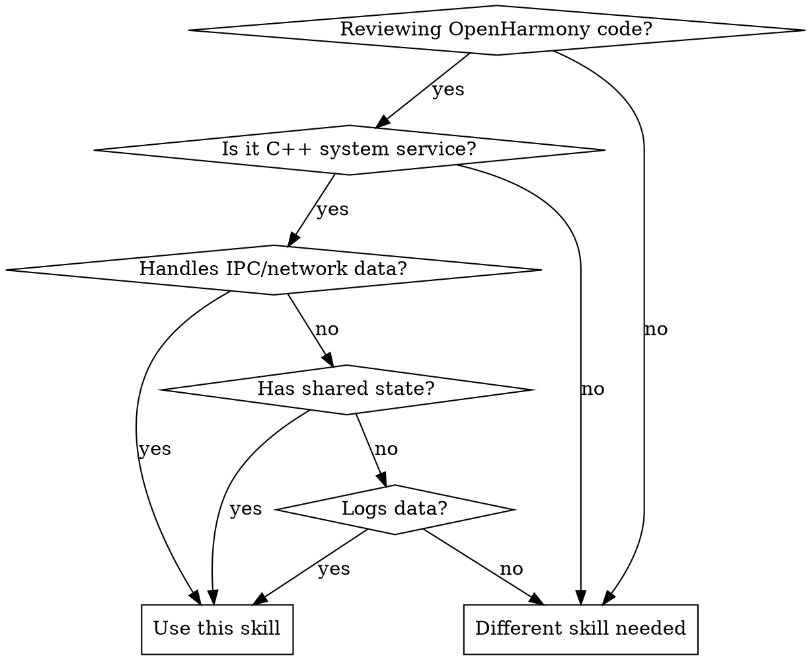

# OpenHarmony Security Review

## Overview

OpenHarmony system services run with high privileges and handle untrusted inputs via IPC and network interfaces. This skill provides a structured approach to identifying critical security vulnerabilities in four key areas: external input handling, multithreading race conditions, sensitive information leakage, and permission validation.

## When to Use



**Use this skill when:**
- Reviewing OpenHarmony C++ system service code (xxxService, xxxStub implementations)
- Code handles IPC (MessageParcel) or network data (JSON/XML/Protobuf)
- Code has multithreaded access to shared state
- Code performs logging of user data or pointers
- Code validates permissions or accesses protected resources

**Do NOT use for:**
- Application-layer code (use standard secure coding practices instead)
- Non-OpenHarmony C++ code (use general security review skills)
- Performance optimization (use different skill)

## Code Traversal Strategy

**Header file input (.h/.hpp):** Analyze corresponding xxxService.cpp and xxxStub.cpp
**Stub file input (xxxStub.cpp):** Extend analysis to xxxService.cpp (core logic + shared state)
**External calls:** Flag cross-component concurrency risks for separate review

## Quick Reference: Critical Vulnerability Checklist

| Category | Critical Checks | Severity |
|----------|----------------|----------|
| **IPC Deserialization** | All MessageParcel reads checked for success | HIGH |
| **Logical Validation** | Array lengths/indices validated AFTER deserialization | HIGH |
| **Integer Bounds** | Size variables: `0 <= size <= MAX_ALLOWED_BUFFER` | HIGH |
| **Object Lifecycle** | RemoteObjects/fd validated before use (nullptr check) | HIGH |
| **Parser Security** | Network parsers reject malformed input, prevent recursion attacks | HIGH |
| **Container Thread Safety** | All container operations protected (read/write, write/write) | HIGH |
| **Iterator Invalidation**** | No modification while iterating | HIGH |
| **Lock Consistency** | All shared state access protected by mutex | HIGH |
| **Deadlock Risk** | Nested locks acquired in consistent order | HIGH |
| **TOCTOU** | State checks immediately followed by dependent action | HIGH |
| **PII in Logs** | No phone numbers, contacts, SMS, biometrics in logs | HIGH |
| **Input Events in Logs**** | No raw KeyEvents, touch coordinates, screen bounds | HIGH |
| **Pointer Addresses** | No `%p` or `&variable` in logs (ASLR bypass) | HIGH |
| **Permission Check** | All privileged operations validate caller permissions | HIGH |

## 1. External Input Handling (IPC & Network)

### 1.1 IPC Deserialization Integrity

**Rule:** Every MessageParcel read operation must check return value.

**Anti-pattern:**
```cpp
// ❌ VULNERABLE: No validation
parcel.ReadInt32(val);
int32_t size = parcel.ReadInt32();
```

**Required pattern:**
```cpp
// ✅ SECURE: Always check return value
if (!parcel.ReadInt32(val)) {
    HILOG_ERROR("Failed to read value");
    return ERR_INVALID_DATA;
}
if (!parcel.ReadInt32(size)) {
    HILOG_ERROR("Failed to read size");
    return ERR_INVALID_DATA;
}
```

**Verification:** Confirm read data size matches expected type size. Stop processing immediately on read failure.

### 1.2 Post-Deserialization Logical Validation

**Rule:** After deserializing, validate values are within logical bounds BEFORE use.

**Attack vector:** Attacker sends `size = 0xFFFFFFFF` to cause memory exhaustion or integer overflow in `new char[size]`.

**Anti-pattern:**
```cpp
// ❌ VULNERABLE: No bounds validation
int32_t size = parcel.ReadInt32();
std::vector<char> buffer(size);  // May allocate gigabytes or overflow
```

**Required pattern:**
```cpp
// ✅ SECURE: Validate bounds immediately
int32_t size = 0;
if (!parcel.ReadInt32(size)) {
    return ERR_INVALID_DATA;
}
constexpr int32_t MAX_ALLOWED_BUFFER = 1024 * 1024;  // 1MB
if (size < 0 || size > MAX_ALLOWED_BUFFER) {
    HILOG_ERROR("Invalid size: %{public}d", size);
    return ERR_INVALID_DATA;
}
std::vector<char> buffer(size);
```

**Validation targets:** Array lengths, indices, loop counters, buffer sizes

### 1.3 Object Lifecycle & Ownership

**Rule:** Validate RemoteObjects and file descriptors before use.

**Required pattern:**
```cpp
// ✅ SECURE: Validate before use
if (remoteObject == nullptr) {
    HILOG_ERROR("Received null RemoteObject");
    return ERR_NULL_OBJECT;
}
if (fd < 0) {
    HILOG_ERROR("Invalid file descriptor");
    return ERR_INVALID_FD;
}
```

### 1.4 External Network Data

**Rule:** Network parsers must reject malformed input and prevent recursion attacks.

**Checks:**
- JSON parsers configured to reject malformed input
- Protection against "Zip Bomb" attacks
- Limits on deeply nested recursion

## 2. Multithreading & Concurrency

### 2.1 Container Thread Safety (Highest Priority)

**Rule:** All concurrent container operations must be protected by locks.

**Critical risks:**
- **Read/Write:** One thread reads while another writes
- **Write/Write:** Multiple threads modify simultaneously
- **Iterator invalidation:** One thread modifies while another iterates

**Anti-pattern:**
```cpp
// ❌ VULNERABLE: Unprotected concurrent access
std::vector<int> items_;

void AddItem(int item) {
    items_.push_back(item);  // Unsafe if called concurrently
}

void ProcessItems() {
    for (auto& item : items_) {  // Iteration
        // If AddItem called here, iterator invalidates → CRASH
    }
}
```

**Required pattern:**
```cpp
// ✅ SECURE: All access protected
std::vector<int> items_;
std::mutex itemsMutex_;

void AddItem(int item) {
    std::lock_guard<std::mutex> lock(itemsMutex_);
    items_.push_back(item);
}

void ProcessItems() {
    std::lock_guard<std::mutex> lock(itemsMutex_);
    for (auto& item : items_) {
        // Safe - lock held during iteration
    }
}
```

**Container types to scrutinize:** `std::vector`, `std::map`, `std::list`, `std::unordered_map`, `std::string`

**Scrutinize operations:** `push_back`, `insert`, `erase`, `operator[]`, `at`, iteration

### 2.2 Locking Mechanisms

**Rule:** All shared resources must be consistently protected.

**Shared resources requiring protection:**
- Global/static variables
- Class member variables
- Heap-allocated objects shared between threads

**Lock types:** `std::mutex`, `std::shared_mutex`, `SpinLock`

**Anti-pattern:**
```cpp
// ❌ VULNERABLE: Inconsistent protection
class Service {
    std::map<int, Data> dataMap_;
    std::mutex mutex_;

    void Update(int key, const Data& data) {
        std::lock_guard<std::mutex> lock(mutex_);
        dataMap_[key] = data;
    }

    Data Lookup(int key) {
        // ❌ NO LOCK - race condition with Update
        return dataMap_[key];
    }
};
```

**Required pattern:**
```cpp
// ✅ SECURE: Consistent protection
class Service {
    std::map<int, Data> dataMap_;
    std::mutex mutex_;

    void Update(int key, const Data& data) {
        std::lock_guard<std::mutex> lock(mutex_);
        dataMap_[key] = data;
    }

    Data Lookup(int key) {
        std::lock_guard<std::mutex> lock(mutex_);
        return dataMap_[key];
    }
};
```

### 2.3 Deadlock Prevention

**Rule:** Assess deadlock risk in nested lock scenarios.

**Deadlock conditions:**
- Multiple locks acquired in different orders by different code paths
- Lock held while calling external function that might acquire locks

**Anti-pattern:**
```cpp
// ❌ VULNERABLE: Deadlock risk
void Path1() {
    std::lock_guard<std::mutex> lock1(mutex1_);
    std::lock_guard<std::mutex> lock2(mutex2_);  // Order: 1 then 2
}

void Path2() {
    std::lock_guard<std::mutex> lock2(mutex2_);
    std::lock_guard<std::mutex> lock1(mutex1_);  // Order: 2 then 1 → DEADLOCK
}
```

**Required pattern:**
```cpp
// ✅ SECURE: Consistent lock order
void Path1() {
    std::lock_guard<std::mutex> lock1(mutex1_);
    std::lock_guard<std::mutex> lock2(mutex2_);  // Order: 1 then 2
}

void Path2() {
    std::lock_guard<std::mutex> lock1(mutex1_);  // Same order: 1 then 2
    std::lock_guard<std::mutex> lock2(mutex2_);
}
```

### 2.4 TOCTOU (Time-of-Check to Time-of-Use)

**Rule:** State checks must be immediately followed by dependent action without gaps.

**Anti-pattern:**
```cpp
// ❌ VULNERABLE: TOCTOU window
if (fileExists(path)) {
    // Attacker can delete/replace file here
    file = openFile(path);  // May open different file
}
```

**Required pattern:**
```cpp
// ✅ SECURE: Atomic check-and-use
file = openFile(path);
if (file.isValid()) {
    // Use file
}
```

## 3. Sensitive Information Protection

### 3.1 Strict PII Redaction

**Rule:** Logging must redact all Personally Identifiable Information (PII).

**PII requiring redaction:**
- **User privacy:** Phone numbers, contacts, SMS content, biometric data
- **Input events:** Raw KeyEvents, touch coordinates (x, y), screen position bounds (Rect)

**Anti-pattern:**
```cpp
// ❌ VULNERABLE: Logs PII
HILOG_INFO("Phone: %{public}s", phoneNumber.c_str());
HILOG_ERROR("Touch at (%{public}d, %{public}d)", x, y);
```

**Required pattern:**
```cpp
// ✅ SECURE: Redact or suppress
HILOG_INFO("Phone: %{private}s", phoneNumber.c_str());  // Redacted
// Better: Don't log PII at all
HILOG_INFO("Processing phone number");
```

**Policy:** Prefer complete suppression in release builds. Use `%{private}` format specifier only when absolutely necessary for debugging.

### 3.2 Memory Layout Leakage (ASLR Bypass)

**Rule:** Never log raw pointer addresses.

**Anti-pattern:**
```cpp
// ❌ VULNERABLE: Leaks addresses for ASLR bypass
HILOG_INFO("Object at %p", &object);
HILOG_DEBUG("Buffer address: %{public}p", buffer);
```

**Required pattern:**
```cpp
// ✅ SECURE: No address logging
HILOG_INFO("Object created");
// Use opaque IDs instead of pointers
HILOG_INFO("Object ID: %{public}d", object.id_);
```

**Rationale:** Leaking heap/stack addresses helps attackers bypass ASLR (Address Space Layout Randomization).

## 4. Permission Validation

**Rule:** All privileged operations must validate caller permissions.

**Anti-pattern:**
```cpp
// ❌ VULNERABLE: No permission check
int32_t Service::DeleteFile(const std::string& path) {
    // Any caller can delete any file!
    return unlink(path.c_str());
}
```

**Required pattern:**
```cpp
// ✅ SECURE: Validate permissions
int32_t Service::DeleteFile(const std::string& path) {
    // Verify caller has permission to access this path
    if (!HasPermission(callerToken_, path, Permission::DELETE)) {
        HILOG_ERROR("Permission denied for path: %{private}s", path.c_str());
        return ERR_PERMISSION_DENIED;
    }

    // Verify path is within allowed sandbox
    if (!IsPathInSandbox(path)) {
        HILOG_ERROR("Path outside sandbox: %{private}s", path.c_str());
        return ERR_INVALID_PATH;
    }

    return unlink(path.c_str());
}
```

**Permission checks required for:**
- File system operations (read, write, delete)
- System settings modifications
- Hardware access (camera, microphone, location)
- Inter-process communication
- Network operations

## Common Mistakes

| Mistake | Consequence | Fix |
|---------|-------------|-----|
| Forgetting to check MessageParcel return values | Uninitialized data use, crashes | Always check return value |
| Validating size but not lower bound (negative) | Negative sizes pass validation | Check `0 <= size <= MAX` |
| Protecting write but not read on shared container | Race condition during reads | Protect ALL access |
| Using iterator after container modification | Iterator invalidation, crashes | Hold lock during iteration |
| Logging with `%{public}` for PII | Information leakage | Use `%{private}` or don't log |
| Printing pointer addresses for debugging | ASLR bypass | Use opaque IDs |
| Skipping permission check "because it's internal" | Privilege escalation if called externally | Always validate |

## Review Output Format

Flag violations with this format:

```
**[HIGH SECURITY RISK] <Category>**

Location: <file_path>:<line_number>

Issue: <description>

Anti-pattern:
```cpp
<code>
```

Required fix:
```cpp
<code>
```

Impact: <attacker capability if exploited>
```

## Real-World Impact

**Container race conditions:** Use-after-free crashes, privilege escalation through corrupted state
**IPC validation failures:** Remote code execution via deserialization exploits, memory exhaustion DoS
**PII leakage:** Privacy violations, GDPR compliance failures
**ASLR bypass:** Enables exploitation of memory corruption vulnerabilities
**Missing permission checks:** Unauthorized access to sensitive data, system modification
