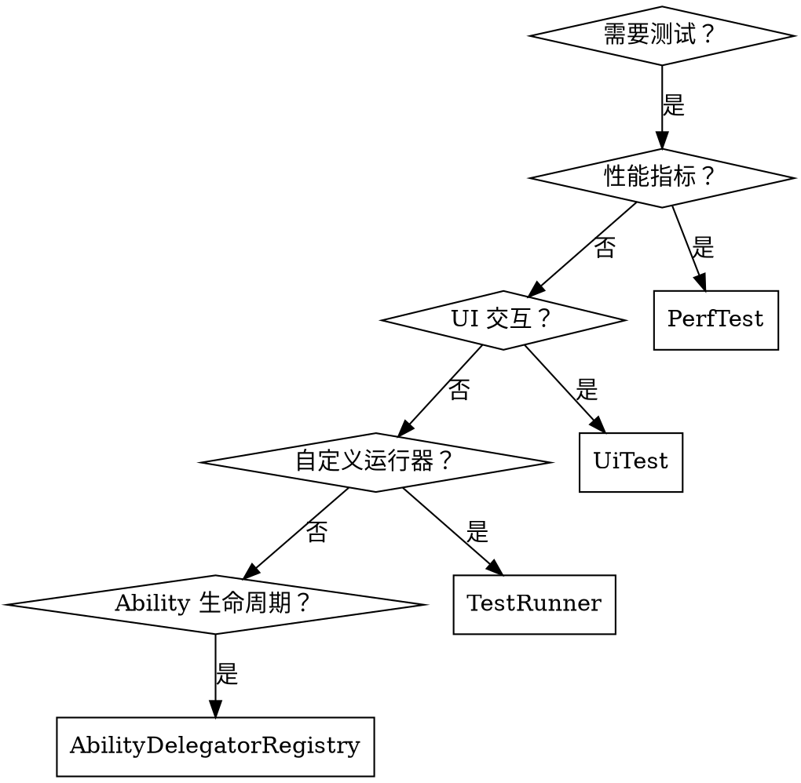

# OpenHarmony 测试 API

## 概述

OpenHarmony 提供四个测试框架模块，用于全面的应用程序测试：
- **@ohos.app.ability.abilityDelegatorRegistry** (API 9+) - 测试框架入口点，提供 AbilityDelegator 和 AbilityDelegatorArgs
- **@ohos.application.testRunner** (API 8+) - 用于实现自定义测试运行器的基础测试框架
- **@ohos.UiTest** (API 8+) - UI 自动化测试，用于模拟用户交互
- **@ohos.test.PerfTest** (API 20+) - 白盒性能测试，用于指标收集

**重要提示**：所有测试 API 只能在测试上下文（JsUnit、UiTest）中使用。不支持并发调用。

## 各框架使用场景



## 快速参考

| 模块 | API 版本 | 用途 | 导入方式 |
|--------|-----------|---------|--------|
| **abilityDelegatorRegistry** | 9+ | 获取 AbilityDelegator/Args，管理 Ability 生命周期 | `from '@kit.TestKit'` |
| **testRunner** | 8+ | 实现自定义测试运行器 | `from '@kit.TestKit'` |
| **UiTest** | 8+ | 模拟 UI 交互（点击、滑动、输入） | `from '@kit.TestKit'` |
| **PerfTest** | 20+ | 测量性能（耗时、CPU、内存、FPS） | `from '@kit.TestKit'` |

## 模块概述

### AbilityDelegatorRegistry

**使用场景**：需要启动 Ability、监控 Ability 生命周期状态或访问测试参数。

```typescript
import { abilityDelegatorRegistry } from '@kit.TestKit';

// 获取 delegator
let delegator = abilityDelegatorRegistry.getAbilityDelegator();

// 获取测试参数
let args = abilityDelegatorRegistry.getArguments();
```

**核心能力**：启动 Ability、添加 AbilityMonitor 监听生命周期、执行 Shell 命令、等待 Ability。

**详见**：@ability-delegator-registry.md 获取完整 API 参考。

### TestRunner

**使用场景**：需要实现自定义测试运行器，包含特定的环境设置或测试执行逻辑。

```typescript
import { TestRunner } from '@kit.TestKit';

export default class UserTestRunner implements TestRunner {
  onPrepare() {
    console.info('触发 onPrepare');
  }

  onRun() {
    console.info('触发 onRun');
  }
}
```

**核心方法**：`onPrepare()` - 设置测试环境，`onRun()` - 执行测试用例。

**详见**：@test-runner.md 获取完整 API 参考。

### UiTest

**使用场景**：需要自动化 UI 测试 - 模拟点击、滑动、文本输入或验证组件属性。

```typescript
import { Driver, ON, Component } from '@kit.TestKit';

// 创建 driver
let driver = Driver.create();

// 查找组件并交互
let button = await driver.find(ON.id('submitBtn'));
await button.click();
```

**核心类**：
- **Driver** - 入口类，查找组件、注入按键、截图
- **ON** - 组件匹配（按 text、id、type、clickable 等）
- **Component** - 表示 UI 元素，提供点击、输入、滚动操作
- **UiWindow** - 窗口操作（拖动、调整大小、获取属性）

**注意**：API 9+ 使用 **ON**、**Component**、**Driver**。API 8 使用 **BY**、**UiComponent**、**UiDriver**（已废弃）。

**详见**：@uitest.md 获取完整 API 参考。

### PerfTest

**使用场景**：需要测量代码性能 - 执行时间、CPU 使用率、内存、应用启动延迟、页面切换时间或列表滚动 FPS。

```typescript
import { PerfTest, PerfMetric, PerfTestStrategy } from '@kit.TestKit';

let actionCode = async (finish: Callback<boolean>) => {
  // 要测试的代码
  finish(true);
};

let strategy: PerfTestStrategy = {
  metrics: [PerfMetric.DURATION, PerfMetric.CPU_USAGE],
  actionCode: actionCode,
  iterations: 10
};

let perfTest = PerfTest.create(strategy);
await perfTest.run();
let result = perfTest.getMeasureResult(PerfMetric.DURATION);
console.info(`平均耗时: ${result.average}ms`);
```

**可用指标**：
- **DURATION** - 代码执行时间（毫秒）
- **CPU_LOAD** - 进程 CPU 负载（%）
- **CPU_USAGE** - 进程 CPU 使用率（%）
- **MEMORY_RSS** - 物理内存（含共享库）（KB）
- **MEMORY_PSS** - 物理内存（不含共享库）（KB）
- **APP_START_RESPONSE_TIME** - 应用启动响应延迟（毫秒）
- **APP_START_COMPLETE_TIME** - 应用启动完成延迟（毫秒）
- **PAGE_SWITCH_COMPLETE_TIME** - 页面切换完成延迟（毫秒）
- **LIST_SWIPE_FPS** - 列表滚动帧率（fps）

**详见**：@perftest.md 获取完整 API 参考。

## 导入方式

```typescript
// AbilityDelegatorRegistry
import { abilityDelegatorRegistry } from '@kit.TestKit';

// TestRunner
import { TestRunner } from '@kit.TestKit';

// UiTest（推荐用于 API 9+）
import { Driver, ON, Component, UiWindow, MatchPattern } from '@kit.TestKit';

// PerfTest
import { PerfTest, PerfMetric, PerfTestStrategy, PerfMeasureResult } from '@kit.TestKit';
```

## 常见错误

| 错误 | 修正 |
|---------|-----|
| 在生产代码中使用测试 API | 测试 API 仅在测试上下文（JsUnit、UiTest）中有效 |
| 未在 PerfTest 的 actionCode 中调用 `finish()` 回调 | 始终调用 `finish(boolean)` 以通知完成 |
| 使用已废弃的 API 8 UiTest 类（BY、UiDriver） | 改用 API 9+ 类（ON、Driver） |
| 并发调用测试框架 API | 框架不支持并发调用 |
| 期望 PerfTest 收集系统范围的指标 | 指标是每个应用的，不是系统范围的 |
| 忘记调用 PerfTest 的 `destroy()` | 使用后始终清理 PerfTest 对象 |

## API 版本支持摘要

| API 版本 | 新特性 |
|-----------|--------------|
| 8 | 初始 UiTest（BY、UiComponent、UiDriver）、TestRunner、AbilityDelegatorRegistry |
| 9 | UiTest 现代化 API（ON、Component、Driver）、相对定位（isBefore、isAfter） |
| 10 | UiDirection、MouseButton、UIElementInfo |
| 11 | 原子服务 API 支持、WindowFilter 的 active 标志 |
| 14 | AbilityStageMonitor 支持 |
| 18 | REG_EXP 匹配模式、支持 pattern 的 id()、触控板滑动 |
| 20 | PerfTest 模块、InputTextMode、Point/Rect 不再只读 |
| 22 | 窗口变化事件、组件操作事件 |
